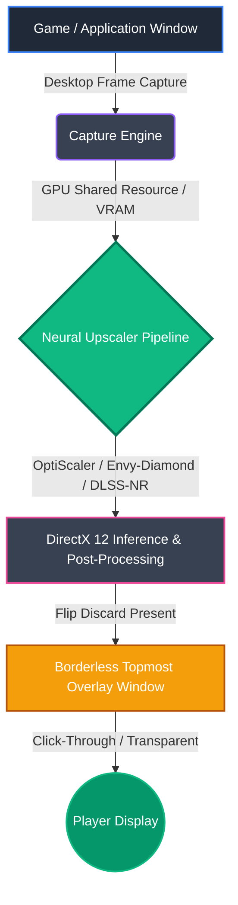

<div align="center">
  
  <h1>🌟 FSR-NG-Scaling 🌟<br><sub>Powered by Envy-Diamond 💎 / OptiScaler</sub></h1>
  
  <p><strong>Next-Gen Lossless Real-Time Neural Scaler & Desktop Overlay for Windows 11</strong></p>
  
  <a href="https://paypal.me/mnecstream"></a>
  
  
  
  
</div>

<br/>

> [!NOTE]  
> **FSR-NG-Scaling** is a standalone, ultra-low latency real-time neural upscaler for Windows 11 (C++20 / DirectX 12). Inspired by Lossless Scaling and Magpie, it captures games and desktop windows, applies hardware-accelerated generative scaling and temporal reconstruction on AMD Radeon / NVIDIA GPUs, and presents the result through a transparent, click-through borderless overlay.

---

## 📑 Table of Contents
- [✨ Key Features](#-key-features)
- [🧩 Architecture & Workflow](#-architecture--workflow)
- [🎮 Hotkeys & In-Game Controls](#-hotkeys--in-game-controls)
- [⚙️ Configuration (`settings.ini`)](#️-configuration-settingsini)
- [🛠️ Requirements & Building from Source](#️-requirements--building-from-source)
- [📦 Pre-built Release Installation](#-pre-built-release-installation)
- [📂 Project Structure](#-project-structure)
- [💖 Support the Project](#-support-the-project)
- [📄 License & Disclaimer](#-license--disclaimer)

---

## ✨ Key Features

* 🛡️ **Zero Process Injection:** Completely external and non-invasive. Does not modify game memory, inject remote threads, or replace game binaries. Compatible with anti-cheat systems.
* 🚀 **Multi-Backend Neural Upscaling:** Seamlessly runs advanced neural scaling backends (Envy-Diamond, OptiScaler, DLSS-NR on AMD, XeSS, FSR 3.x) with native DX12 execution.
* 🖱️ **Full Mouse Click-Through:** Features an intelligent dual-mode overlay:
  * **Game Mode:** Mouse clicks, mouse look, and raw input pass directly to the game underneath (`HTTRANSPARENT`).
  * **Menu Mode:** Instantly unlocks mouse cursor to interact with runtime GUI controls and configurations.
* ⏱️ **Temporal Stability & Hysteresis:** Suppresses ghosting and subpixel shimmering through temporal accumulation and bounding AABB color clamping.
* 📐 **Automatic DPI & Multi-Monitor Support:** Automatically adapts to Windows 11 display scaling (100%, 125%, 150%, 200%) to ensure perfect 1:1 pixel coverage without corner cropping.
* ⚡ **Ultra-Low Latency Presentation:** Direct DXGI Flip-Discard swapchain (`DXGI_SWAP_EFFECT_FLIP_DISCARD`) synchronized with display VSync.

---

## 🧩 Architecture & Workflow



---

## 🎮 Hotkeys & In-Game Controls

FSR-NG-Scaling runs silently in the background and can be controlled on the fly:

| Shortcut | Action | Description |
| :--- | :--- | :--- |
| <kbd>Ctrl</kbd> + <kbd>Alt</kbd> + <kbd>S</kbd> | **Toggle Overlay** | Activates or hides the real-time scaling overlay. |
| <kbd>Ctrl</kbd> + <kbd>Alt</kbd> + <kbd>M</kbd> | **Toggle Menu / Game Mode** | Switches mouse input between pass-through (Game) and interactive (GUI). |
| <kbd>Ctrl</kbd> + <kbd>Alt</kbd> + <kbd>R</kbd> | **Reload Config** | Re-reads `config/settings.ini` live without restarting. |
| <kbd>Insert</kbd> | **In-Game Menu** | Toggles the native OptiScaler / Envy-Diamond configuration menu (unlock mouse first). |
| <kbd>Ctrl</kbd> + <kbd>C</kbd> | **Exit** | Gracefully terminates the application and frees all GPU resources. |

---

## ⚙️ Configuration (`config/settings.ini`)

All core engine settings can be adjusted in `config/settings.ini`:

```ini
[Scaling]
; Scaling profile: Native, Quality, Balanced, Performance, UltraPerformance
dlss_mode = Performance

; Custom scale factor multiplier (used when not in fixed mode)
scale_factor = 1.0

; Automatically adapt to Windows DPI scaling (e.g. 150%, 200%)
auto_dpi_scale = true

[Performance]
; FPS target limit (0 = uncapped / monitor refresh rate)
fps_limit = 0

[Debug]
; Split screen comparison (0.0 = full upscaled, 0.5 = 50/50 split)
debug_split_screen = 0.0
```

---

## 🛠️ Requirements & Building from Source

### Prerequisites
* **Operating System:** Windows 11 64-bit (x64)
* **Compiler:** Microsoft Visual C++ (MSVC) with C++20 support (Visual Studio 2022 v17.x or later)
* **Windows SDK:** 10.0.19041.0 or higher (SDK 10.0.28000+ recommended)
* **Build System:** CMake 3.20+

### Build Steps:
1. Clone the repository:
   ```bash
   git clone https://github.com/mnector/FSR-NG-Scaling.git
   cd FSR-NG-Scaling
   ```
2. Build via the automated batch script:
   ```cmd
   build.bat
   ```
   *Or manually using CMake:*
   ```cmd
   cmake -B build -A x64
   cmake --build build --config Release
   ```

---

## 📦 Pre-built Release Installation

1. Download `FSR-NG-Scaling-v1.0.0-win64.zip` from the [Releases](https://github.com/mnector/FSR-NG-Scaling/releases) section.
2. Extract the archive to any folder of your choice.
3. Launch `FSR-NG-Scaling.exe`.
4. Open your game in Windowed or Borderless Windowed mode.
5. Press <kbd>Ctrl</kbd> + <kbd>Alt</kbd> + <kbd>S</kbd> to activate lossless neural scaling!

---

## 📂 Project Structure

```text
FSR-NG-Scaling/
├── 📄 CMakeLists.txt           # CMake build script (MSVC C++20 / DX12)
├── 📖 README.md                # Documentation and usage guide
├── 🛠️ build.bat                # One-click Release build script
├── 📦 backend/                 # Engine bridges, upscaler backends and weights
├── ⚙️ config/                  # Runtime settings (settings.ini)
├── 🎨 shaders/                 # HLSL Compute Shaders
└── 💻 src/
    ├── capture/                # Screen capture & frame pool
    ├── display/                # Borderless overlay & Swapchain Presenter
    ├── neural_engine/          # NGX API and neural scaling coordinator
    └── utils/                  # Config parser & global hotkeys
```

---

## 💖 Support the Project

If you enjoy FSR-NG-Scaling and would like to support ongoing development and research:

<div align="center">
  <a href="https://paypal.me/mnecstream" target="_blank">
    
  </a>
</div>

---

## 📄 License & Disclaimer

FSR-NG-Scaling is released under the **MIT License**.  
All trademarks, product names, and company logos are the property of their respective owners. This software is an independent research project and is not affiliated with, endorsed by, or sponsored by NVIDIA Corporation or Advanced Micro Devices, Inc.
