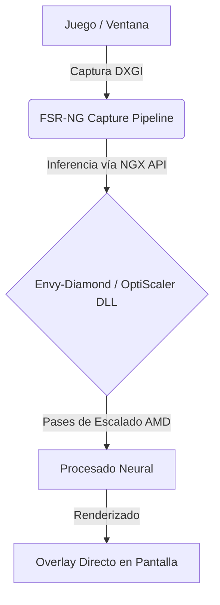

# FSR-NG-Scaling (Powered by Envy-Diamond 💎)

Aplicación nativa para Windows 11 (C++20 / DirectX 12) diseñada para escalar y mejorar en tiempo real fotogramas de cualquier ventana o videojuego utilizando **el motor y backend de Envy-Diamond / OptiScaler** en GPUs AMD Radeon, proyectando el resultado a través de un overlay sin bordes de latencia ultra-baja.

[](https://paypal.me/mnecstream)

## Tabla de Contenidos
- [Características Principales](#características-principales)
- [Arquitectura y Funcionamiento](#arquitectura-y-funcionamiento)
- [Estructura del Proyecto](#estructura-del-proyecto)
- [Requisitos y Compilación](#requisitos-y-compilación)
- [Controles FSR-NG-Scaling](#controles-fsr-ng-scaling)
- [Donaciones](#donaciones)

---

## Características Principales

*   **Cero Inyección de Procesos:** No utiliza wrappers ni modifica la memoria del juego de forma invasiva, extrayendo frames directamente desde DXGI.
*   **Motor Envy-Diamond (OptiScaler):** Aprovecha la tecnología de pases múltiples neurales para renderizado en GPUs AMD, integrada nativamente en el pipeline de la aplicación.
*   **Acumulación Temporal e Histéresis:** Búfer de historia que suprime el ghosting mediante clamping local (AABB).
*   **Overlay Ultra-Baja Latencia:** Ventana transparente con SwapChain en modelo Flip Discard y soporte de tearing.

---

## Arquitectura y Funcionamiento



---

## Estructura del Proyecto

```text
FSR-NG-Scaling/
├── CMakeLists.txt              # Configuración CMake FSR-NG-Scaling
├── README.md                   # Documentación
├── build.bat                   # Script de compilación Release FSR-NG
├── backend/                    # Librerías de motor Envy-Diamond (OptiScaler.dll, pases AMD, pesos binarios)
├── config/                     # Configuraciones de FSR-NG
├── shaders/                    # Shaders HLSL para el Pipeline Gráfico
└── src/                        # Código fuente C++ (C++20, MSVC, DX12, DXGI)
```

---

## Requisitos y Compilación

Para construir la aplicación independiente de captura de pantalla y sobreposición:
*   **Sistema Operativo:** Windows 11 (x64)
*   **Compilador:** Microsoft Visual Studio 2022 / 2026 (MSVC C++20)
*   **SDK:** Windows 10/11 SDK (10.0.19041+)
*   **CMake:** Versión 3.20 o superior

**Notas sobre el backend:**  
Debes colocar los binarios de **Envy-Diamond** (como `OptiScaler.dll`, los dll de los pases de AMD y los pesos `.bin`) dentro de la carpeta `backend/` antes de ejecutar. *(Por motivos de licencias y tamaño, los binarios pesados no están incluidos en el código fuente de GitHub).*

**Compilación rápida:**
```cmd
build.bat
```

O manualmente mediante CMake:
```cmd
cmake -B build -A x64
cmake --build build --config Release
```

---

## Controles FSR-NG-Scaling

*   **`Ctrl + Alt + S`**: Alternar la escala en vivo (Activar/Desactivar Overlay).
*   **`Ctrl + Alt + W`**: Alternar entre modo Ventana Activa Dinámica y modo Monitor Completo.
*   **`Ctrl + Alt + R`**: Recargar `config/settings.ini` en caliente sin reiniciar la aplicación.
*   **`Ctrl + C`**: Cierre limpio y liberación de recursos GPU.
*   **`Insert` / `Home`**: Mostrar/Ocultar el menú de control GUI (ImGui) de OptiScaler/Envy-Diamond.

---

## Donaciones

Si este proyecto te ha sido útil, considera apoyar su desarrollo:

<br>
<a href="https://paypal.me/mnecstream" target="_blank"></a>
