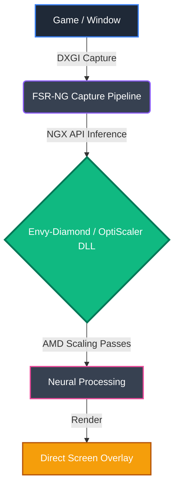

<div align="center">
  
  <h1>🌟 FSR-NG-Scaling 🌟<br><sub>Powered by Envy-Diamond 💎</sub></h1>
  
  <p><strong>Next-Gen AI Image Upscaling for Windows 11</strong></p>
  
  <a href="https://paypal.me/mnecstream"></a>
  
  
</div>

<br/>

> [!NOTE]  
> A native Windows 11 application (C++20 / DirectX 12) designed to scale and enhance real-time frames from **any** window or game. By harnessing the **Envy-Diamond / OptiScaler engine backend** on AMD Radeon GPUs, it projects the result through an ultra-low latency, borderless overlay.

---

## 📑 Table of Contents
- [✨ Key Features](#-key-features)
- [🧩 Architecture & Workflow](#-architecture--workflow)
- [📂 Project Structure](#-project-structure)
- [⚙️ Requirements & Build Guide](#️-requirements--build-guide)
- [🎮 Hotkeys & Controls](#-hotkeys--controls)
- [💖 Support the Project](#-support-the-project)

---

## ✨ Key Features

*   🛡️ **Zero Process Injection:** Doesn't use wrappers or invasively modify game memory. It extracts frames directly via DXGI Desktop Duplication.
*   🚀 **Envy-Diamond Engine (OptiScaler):** Takes advantage of multi-pass neural rendering technology for AMD GPUs, natively integrated into the application's pipeline.
*   ⏱️ **Temporal Accumulation & Hysteresis:** Includes a history buffer that suppresses ghosting through local AABB clamping.
*   🎮 **Standard Game Overlay:** Acts as a standard borderless window to natively support Envy-Diamond / OptiScaler hooks and GUI overlays perfectly.

---

## 🧩 Architecture & Workflow



---

## 📂 Project Structure

```text
FSR-NG-Scaling/
├── 📄 CMakeLists.txt           # FSR-NG CMake configuration
├── 📖 README.md                # Project documentation
├── 🛠️ build.bat                # Quick release compilation script
├── 📦 backend/                 # Envy-Diamond engine libraries (OptiScaler.dll, AMD passes, bin weights)
├── ⚙️ config/                  # FSR-NG settings.ini configuration
├── 🎨 shaders/                 # HLSL Shaders for the Graphics Pipeline
└── 💻 src/                     # C++ Source code (C++20, MSVC, DX12, DXGI)
```

---

## ⚙️ Requirements & Build Guide

To build this standalone screen capture and overlay application from source, you will need:

*   🖥️ **OS:** Windows 11 (x64)
*   🛠️ **Compiler:** Microsoft Visual Studio 2022 / 2026 (MSVC C++20)
*   🧰 **SDK:** Windows 10/11 SDK (10.0.19041+)
*   📦 **CMake:** Version 3.20 or higher

> [!WARNING]  
> **Backend Note:** You must place the **Envy-Diamond** binaries (such as `OptiScaler.dll`, AMD pass DLLs, and `.bin` weights) inside the `backend/` folder before running. *(Due to licensing and file size limits, these heavy binaries are not included in the GitHub source code).*

### Quick Build:
```cmd
build.bat
```

### Manual Build via CMake:
```cmd
cmake -B build -A x64
cmake --build build --config Release
```

---

## 🎮 Hotkeys & Controls

You can control the live FSR-NG-Scaling behavior using the following global hotkeys:

| Shortcut | Action |
| :--- | :--- |
| <kbd>Ctrl</kbd> + <kbd>Alt</kbd> + <kbd>S</kbd> | Toggle live scaling (Enable/Disable). |
| <kbd>Ctrl</kbd> + <kbd>Alt</kbd> + <kbd>M</kbd> | Toggle **Menu Mode** (Unlocks mouse to interact with OptiScaler GUI) and **Game Mode** (Mouse passes through to your game). |
| <kbd>Ctrl</kbd> + <kbd>C</kbd> | Clean exit and GPU resource release (In terminal). |
| <kbd>Insert</kbd> | Show/Hide the **OptiScaler / Envy-Diamond native GUI menu** (Use Ctrl+Alt+M first to unlock mouse!). |

---

## 💖 Support the Project

If you found this project helpful and want to support future development, consider leaving a donation!

<div align="center">
  <a href="https://paypal.me/mnecstream" target="_blank">
    
  </a>
</div>
